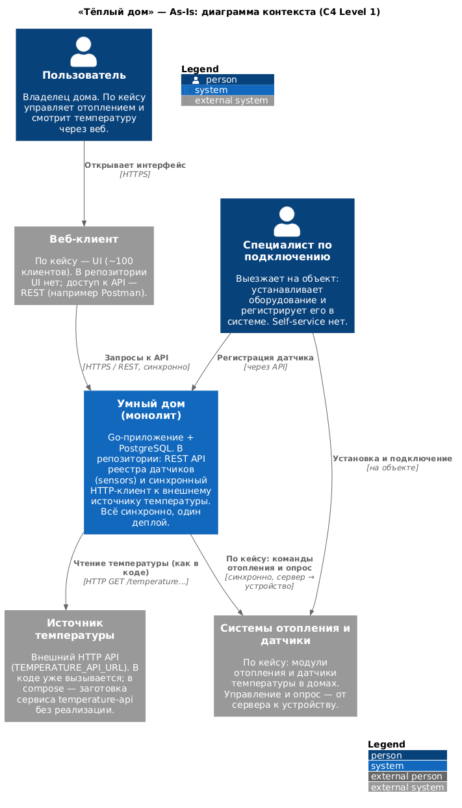
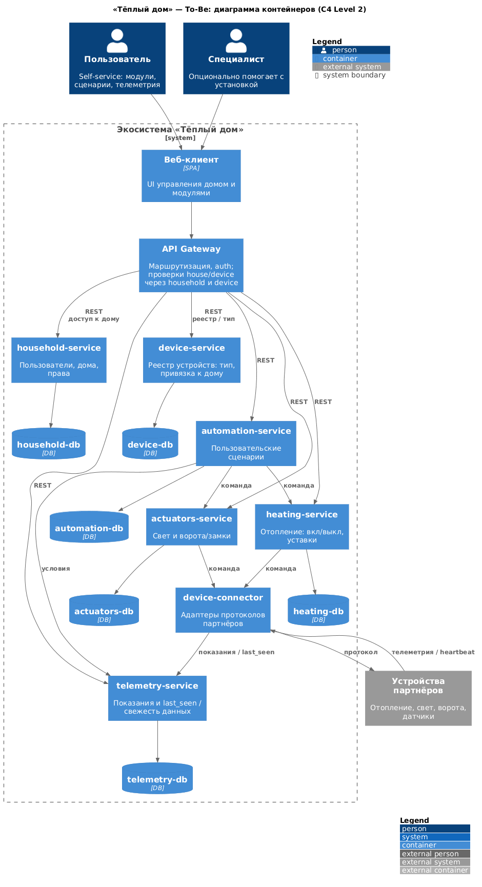
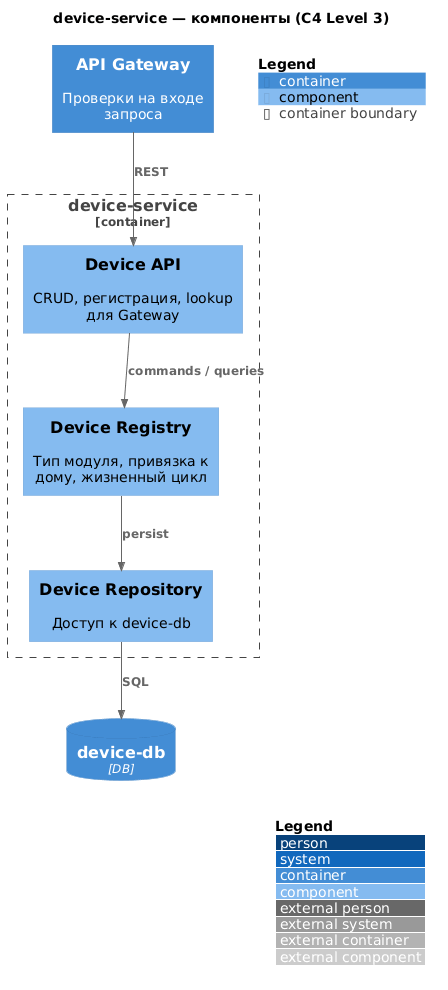
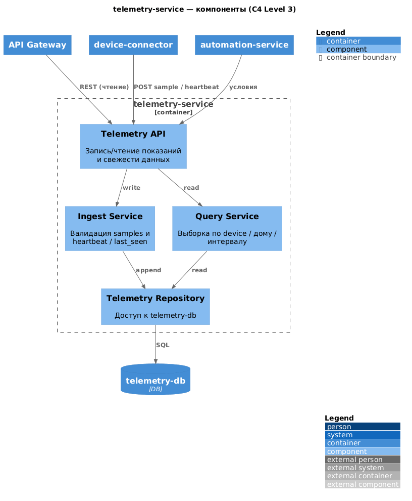
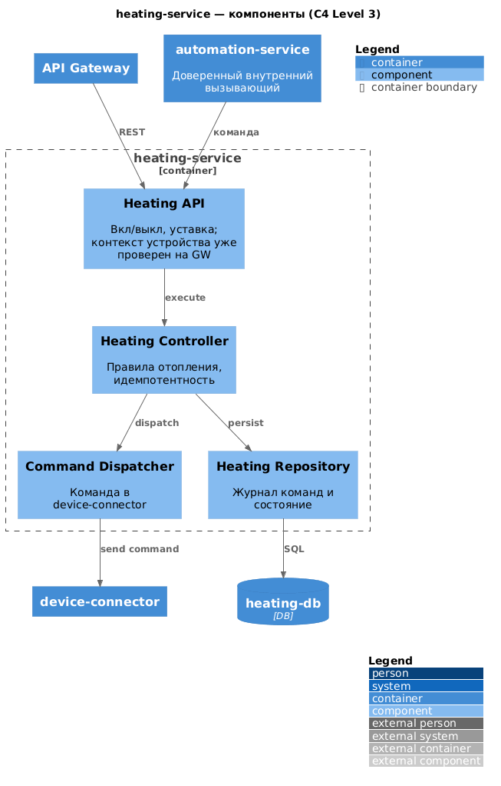
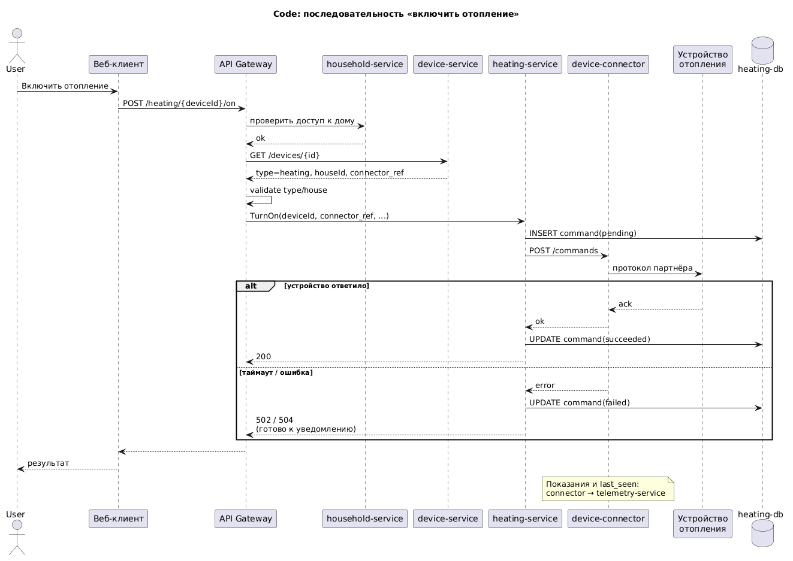
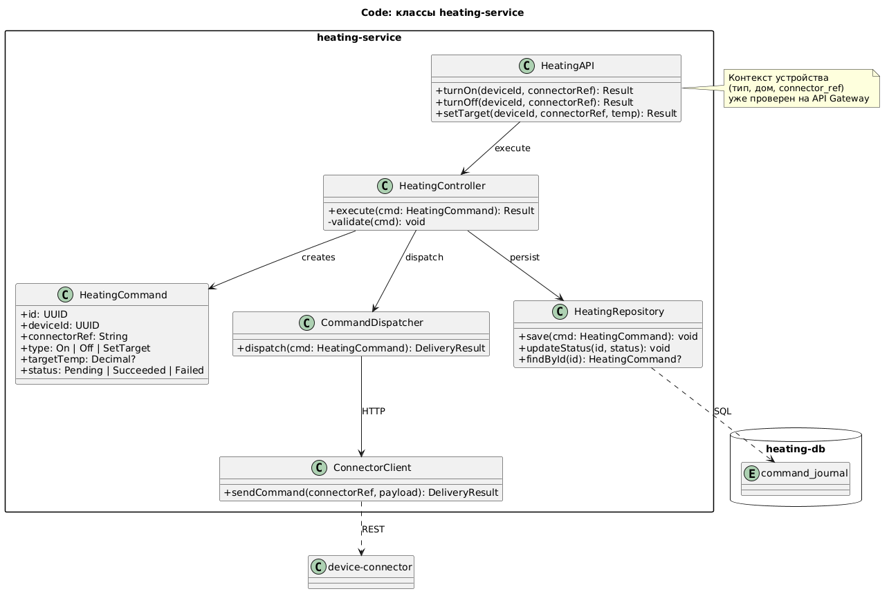
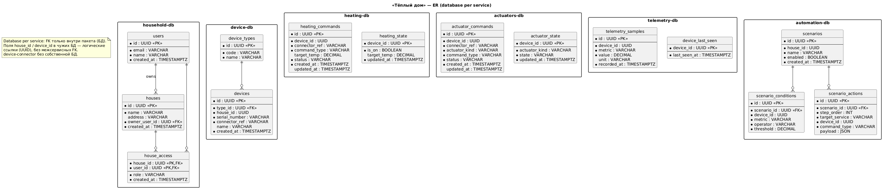

# Project_template

Это шаблон для решения проектной работы. Структура этого файла повторяет структуру заданий. Заполняйте его по мере работы над решением.

# Задание 1. Анализ и планирование

<aside>

Чтобы составить документ с описанием текущей архитектуры приложения, можно часть информации взять из описания компании и условия задания. Это нормально.

</aside>

### 1. Описание функциональности монолитного приложения

Источники As-Is: **бизнес-кейс** («Тёплый дом») и **код репозитория** (`apps/smart_home`). Они совпадают не один в один.

#### По бизнес-кейсу

**Управление отоплением**

- Пользователи удалённо включают/выключают отопление через веб-интерфейс.
- Команды идут от сервера к датчику/реле; устройство само не инициирует обмен.
- Подключение дома - только с выездом специалиста; пользователь сам датчик не подключает.
- Масштаб: ~100 веб-клиентов, ~100 модулей управления отоплением.

**Мониторинг температуры**

- Пользователи смотрят текущую температуру в доме через веб.
- Показания сервер получает синхронным запросом к датчику.

#### По коду репозитория

Отдельного API "включить/выключить отопление" и веб-UI нет. 
Монолит (apps/smart_home) - REST API управления реестром датчиков.

| Возможность | Как устроено |
|-------------|--------------|
| CRUD датчиков | `GET/POST/PUT/DELETE /api/v1/sensors` |
| Обновление value/status | `PATCH /api/v1/sensors/:id/value` - пишет в Postgres, это не команда на железо |
| Температура по location | `GET /api/v1/sensors/temperature/:location` |
| Подмешивание температуры при чтении | в `GetSensors` / `GetSensorByID` для `type=temperature` вызывается HTTP-клиент |

Единственный тип датчика в модели: `temperature`. Данные температуры при чтении запрашиваются у внешнего URL `TEMPERATURE_API_URL` (`TemperatureService` -> `GET .../temperature` и `.../temperature/:id`). В `docker-compose.yml` сервис `temperature-api` объявлен как **заготовка** (без образа/сборки); реализации в репозитории пока нет - это зависимость, которую код уже ожидает.

Итого для дальнейшего проектирования: сценарий отопления берём из кейса; из кода - реестр датчиков, синхронный опрос внешнего источника температуры, одна БД.

### 2. Анализ архитектуры монолитного приложения

| Аспект | As-Is |
|--------|--------|
| Язык | Go |
| СУБД | PostgreSQL, одна БД `smarthome`, таблица `sensors` (`init.sql`) |
| Структура приложения | Один процесс: handlers -> services/db -> Postgres / внешний HTTP |
| Взаимодействие | Только синхронный REST/HTTP; очередей и событий нет |
| Внешние зависимости в коде | Postgres; HTTP API температуры (`TEMPERATURE_API_URL`, порт 8081 в compose) |
| Управление отоплением | Описано в кейсе; в коде эндпоинтов команд к реле нет |
| Масштабирование | Только целиком (вертикально / реплики всего монолита) |
| Развёртывание | Остановка/обновление всего приложения |
| Контейнеры | Dockerfile у `smart_home`; compose: `app`, заготовки `postgres` и `temperature-api` |

Сильные стороны: простая модель, один деплой, понятный CRUD датчиков, контракт на вынос опроса температуры во внешний сервис уже намечен в коде.

### 3. Определение доменов и границы контекстов

| Домен / bounded context | Ответственность | As-Is |
|-------------------------|-----------------|--------|
| **Управление устройствами** | Реестр устройств, статусы, привязка к дому, команды | В коде: CRUD `sensors`; команд на оборудование нет |
| **Управление отоплением** | Вкл/выкл и сценарии отопления | В кейсе - да; в коде отдельного контура нет |
| **Мониторинг телеметрии** | Получение и отдача показаний | В коде: синхронный HTTP к внешнему API температуры; истории/потока событий нет |
| **Дома и доступ пользователей** | Дом, пользователь, права | В кейсе (веб-клиенты); в коде сущностей нет |
| **Сценарии автоматизации** *(To-Be)* | Правила («если T < X - включить отопление») | Нет |
| **Партнёрские устройства** *(To-Be)* | Подключение по стандартным протоколам | Нет |
| **Освещение / ворота / наблюдение** *(To-Be)* | Новые типы устройств экосистемы | Нет |

**Граница As-Is:** один bounded context "Умный дом" - всё в одном приложении и одной схеме БД. Для To-Be домены выше - кандидаты на отдельные сервисы и database-per-service.

### 4. Проблемы монолитного решения

- **Кейс шире кода** - отопление заявлено бизнесом, в репозитории только датчики температуры; домены не выделены.
- **Смешение ответственности** - реестр устройств и телеметрия в одном деплое и одной таблице; новые типы устройств (свет, ворота) потребуют раздувать тот же монолит.
- **Синхронный опрос на чтении** - каждый `GET /sensors` ходит во внешний API температуры; при росте числа домов растут latency и связность, нет буфера/ретраев.
- **Нет self-service** - подключение только через специалиста; не подходит под SaaS и масштаб нескольких регионов.
- **Релизы и масштаб** - нельзя независимо выкатывать/масштабировать телеметрию и командный контур.
- **Нет истории телеметрии** - значение подмешивается в ответ API, отдельного хранилища событий нет.
- **Compose неполон** - Postgres и `temperature-api` в compose ещё нужно довести; стенд из коробки не поднимается.

### 5. Визуализация контекста системы - диаграмма C4

Исходник: [diagrams/as-is-c4-context.puml](diagrams/as-is-c4-context.puml)



На уровне контекста: пользователь (через веб-клиент) и специалист взаимодействуют с монолитом; монолит по кейсу связан с системами отопления/датчиками; по коду уже есть зависимость от внешнего источника температуры. PostgreSQL - внутри границы системы "Умный дом", на Level 1 отдельным актёром не выносится.

# Задание 2. Проектирование микросервисной архитектуры

В этом задании вам нужно предоставить только диаграммы в модели C4. Мы не просим вас отдельно описывать получившиеся микросервисы и то, как вы определили взаимодействия между компонентами To-Be системы. Если вы правильно подготовите диаграммы C4, они и так это покажут.

**Диаграмма контейнеров (Containers)**

Исходник: [diagrams/to-be-c4-containers.puml](diagrams/to-be-c4-containers.puml)



Упрощение: свет и ворота — один `actuators-service`; без брокера; **проверки house/device на API Gateway** (household + device), командные сервисы сразу шлют в connector; last_seen — в telemetry; команду доставляем всегда, итог — по ответу connector.

**Диаграмма компонентов (Components)**

device-service — [diagrams/to-be-c4-components-device.puml](diagrams/to-be-c4-components-device.puml)



telemetry-service — [diagrams/to-be-c4-components-telemetry.puml](diagrams/to-be-c4-components-telemetry.puml)



heating-service — [diagrams/to-be-c4-components-heating.puml](diagrams/to-be-c4-components-heating.puml)



**Диаграмма кода (Code)**

Критичный сценарий: команда «включить отопление» (sequence).

Исходник: [diagrams/to-be-code-heating-command.puml](diagrams/to-be-code-heating-command.puml)



Классы `heating-service`:

Исходник: [diagrams/to-be-code-heating-classes.puml](diagrams/to-be-code-heating-classes.puml)



# Задание 3. Разработка ER-диаграммы

Логическая модель под To-Be и **database per service**: у каждого сервиса своя БД; связи между БД — только по UUID (без межсервисных FK).

Кратко по сущностям:

| БД | Сущности | Связи |
|----|----------|--------|
| household-db | `users`, `houses`, `house_access` | User 1—N House (owner); User N—M House через `house_access` (права, в т.ч. сосед) |
| device-db | `device_types`, `devices` | Type 1—N Device; `house_id` / `connector_ref` — логические ссылки |
| heating-db | `heating_commands`, `heating_state` | Журнал команд и текущее состояние контура по `device_id` |
| actuators-db | `actuator_commands`, `actuator_state` | То же для света/ворот (`actuator_kind`) |
| telemetry-db | `telemetry_samples`, `device_last_seen` | Device 1—N samples; last_seen отдельно |
| automation-db | `scenarios`, `scenario_conditions`, `scenario_actions` | Scenario 1—N conditions/actions; условия — implicit AND; порядок действий — `step_order` |

Исходник: [diagrams/to-be-er.puml](diagrams/to-be-er.puml)



# Задание 4. Создание и документирование API

### 1. Тип API

Используем **REST API (OpenAPI 3)** для всех выбранных взаимодействий.

Почему REST, а не AsyncAPI:
- в To-Be сознательно нет брокера — команды и телеметрия идут синхронно;
- API Gateway, automation и connector ждут ответ сразу (результат команды, lookup устройства, запись sample);
- для учебного ландшафта один стиль контрактов проще сопровождать.

AsyncAPI имел бы смысл при событии `TelemetryReceived` через очередь; в нашей схеме это не требуется.

### 2. Документация API

OpenAPI 3 для **всех** сервисов To-Be (включая API Gateway):

| Сервис | Спецификация |
|--------|----------------|
| API Gateway (публичный API) | [schemas/api-gateway.yaml](schemas/api-gateway.yaml) |
| household-service | [schemas/household-service.yaml](schemas/household-service.yaml) |
| device-service | [schemas/device-service.yaml](schemas/device-service.yaml) |
| heating-service | [schemas/heating-service.yaml](schemas/heating-service.yaml) |
| actuators-service | [schemas/actuators-service.yaml](schemas/actuators-service.yaml) |
| telemetry-service | [schemas/telemetry-service.yaml](schemas/telemetry-service.yaml) |
| automation-service | [schemas/automation-service.yaml](schemas/automation-service.yaml) |
| device-connector | [schemas/device-connector.yaml](schemas/device-connector.yaml) |
| Индекс | [schemas/openapi.yaml](schemas/openapi.yaml) |

Открывать в [Swagger Editor](https://editor.swagger.io/) (Import file).

Gateway — контракт для веб-клиента (JWT + проверки house/device). Остальные файлы — внутренние REST-контракты service-to-service. У эндпоинтов есть request/response, коды статуса и `examples`.

# Задание 5. Работа с docker и docker-compose

Сделано в `apps/`:

1. **temperature-api** (Go) — имитатор датчика:
   - `GET /temperature?location=...`
   - `GET /temperature/:id`
   - каждый ответ с новым random `value`
2. **Dockerfile** + сервис в `docker-compose.yml`, порт **8081**
3. **postgres** в compose: `POSTGRES_DB=smarthome`, init-скрипт `./smart_home/init.sql`, healthcheck

Запуск:

```bash
cd apps
./init.sh
# или: docker-compose up --build -d
```

Проверка (Postman `smarthome-api.postman_collection.json` или curl):

```bash
# Create Sensor
curl -s -X POST http://localhost:8080/api/v1/sensors \
  -H 'Content-Type: application/json' \
  -d '{"name":"Living Room","type":"temperature","location":"Living Room","unit":"°C"}'

# Get All Sensors — value меняется при каждом вызове
curl -s http://localhost:8080/api/v1/sensors
```


# **Задание 6. Разработка MVP**

Необходимо создать новые микросервисы и обеспечить их интеграции с существующим монолитом для плавного перехода к микросервисной архитектуре. 

### **Что нужно сделать**

1. Создайте новые микросервисы для управления телеметрией и устройствами (с простейшей логикой), которые будут интегрированы с существующим монолитным приложением. Каждый микросервис на своем ООП языке.
2. Обеспечьте взаимодействие между микросервисами и монолитом (при желании с помощью брокера сообщений), чтобы постепенно перенести функциональность из монолита в микросервисы. 

В результате у вас должны быть созданы Dockerfiles и docker-compose для запуска микросервисов. 